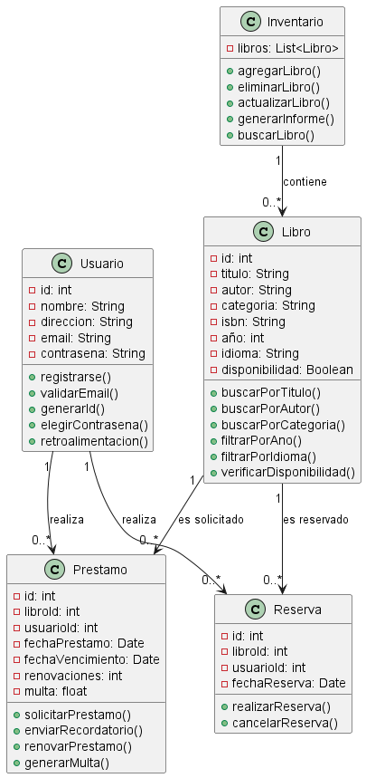
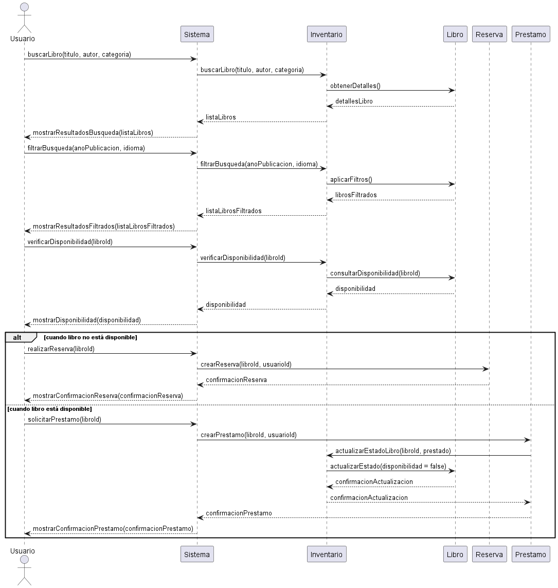
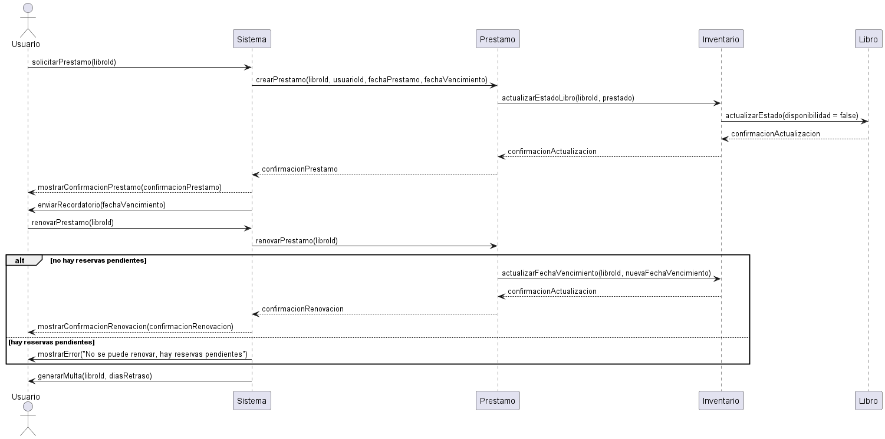
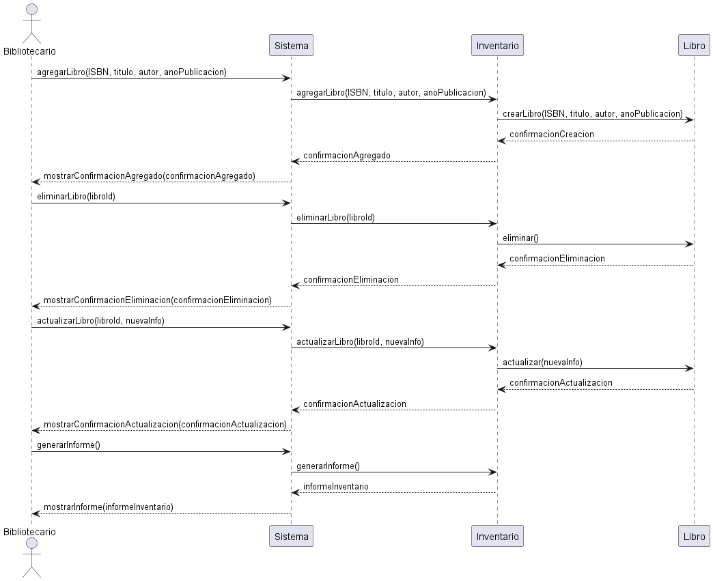
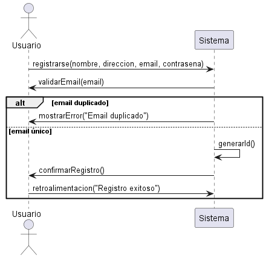
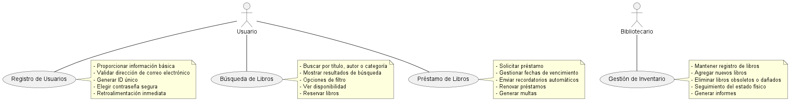

**Diagrama de clases ejercicio de Sistema de gestion de blibioteca**

**Descripcion del ejercicio con diagrama de clases**
 
 El ejercicio consiste en diseñar un Sistema de Gestión de Biblioteca que aborde cuatro requerimientos funcionales clave: Registro de Usuarios, Búsqueda de Libros, Préstamo de Libros, y Gestión de Inventario. 

 **Diagrama de Clases**

- Para abordar estos requerimientos, se utilizó un diagrama de clases en PlantUML que incluye las principales entidades del sistema y sus relaciones. Las clases identificadas son:

- Usuario: Gestiona la información de los usuarios y el proceso de registro.
- Libro: Contiene información sobre los libros y métodos para búsqueda y filtrado.
- Préstamo: Maneja el proceso de préstamo, incluyendo fechas de vencimiento y multas.
- Reserva: Gestiona las reservas de libros por parte de los usuarios.
- Inventario: Mantiene el registro de todos los libros en la biblioteca y permite operaciones de mantenimiento y generación de informes.

**Relaciones**
- Un Usuario puede realizar múltiples Préstamos y Reservas.
- Un Libro puede estar asociado con múltiples Préstamos y Reservas.
- Inventario contiene una lista de Libros.

**Diagrama de secuencia del ejecicio de un Sistema de gestion de blibioteca**

**Descripcion del ejercico con un diagrama de secuencia**

El ejercicio consiste en diseñar un Sistema de Gestión de Biblioteca que aborda cuatro requerimientos funcionales clave: Registro de Usuarios, Búsqueda de Libros, Préstamo de Libros y Gestión de Inventario. 

**Descripción: Este diagrama muestra cómo un usuario se registra en el sistema proporcionando su información personal. El sistema valida el correo electrónico para evitar duplicados, genera un ID único y confirma el registro, proporcionando retroalimentación inmediata.**

**Descripción: Este diagrama muestra cómo un usuario busca libros en el sistema, aplica filtros, verifica la disponibilidad, y puede realizar reservas o solicitar préstamos dependiendo de la disponibilidad del libro.**

**Descripción: Este diagrama muestra el proceso completo de solicitud de préstamo de un libro, incluyendo la gestión de fechas de vencimiento, envío de recordatorios, renovación de préstamos y generación de multas por retrasos.**

**Descripción: Este diagrama muestra cómo los bibliotecarios pueden gestionar el inventario de la biblioteca, incluyendo la adición de nuevos libros, eliminación de libros obsoletos o dañados, actualización de la información de los libros y generación de informes sobre el estado del inventario.**

**Diagrama de casos de uso del ejecicio de un Sistema de gestion de blibioteca**

El ejercicio consiste en diseñar un Sistema de Gestión de Biblioteca que aborda cuatro requerimientos funcionales clave: Registro de Usuarios, Búsqueda de Libros, Préstamo de Libros y Gestión de Inventario. 

Descripcion: Este diagrama muestra los actores y los casos de uso principales con sus subfunciones, proporcionando una visión clara de cómo los usuarios y los bibliotecarios interactúan con el sistema de gestión de biblioteca.

